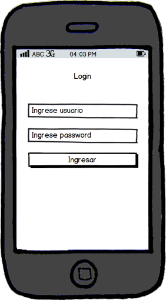

App de login
============

Template del ejercicio de hacer login.

Deberá implementar la siguiente pantalla:

Deberá utilizar los siguientes widgets gráficos (pertenecientes al View):

* TextView
* EditText
* Button

Además utilizar la clase LoginManager que pertenece al modelo y es donde se
encuentra la lógica del negocio.

*Nota:* Ceñirse estrictamente al patrón MVC.
